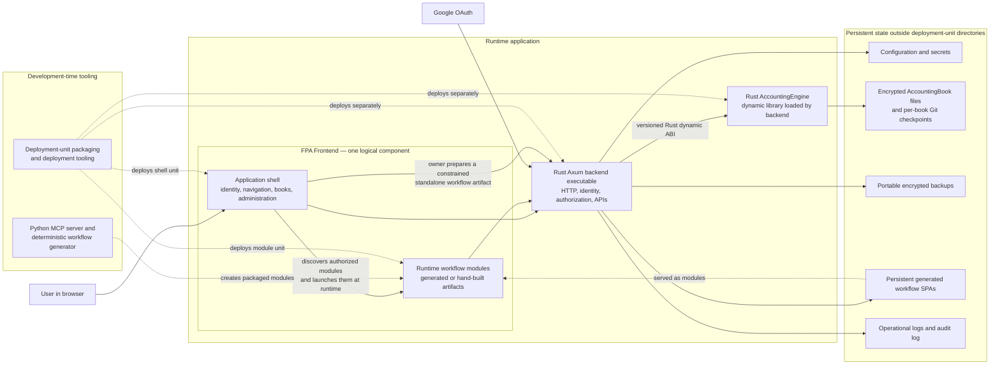

# First Principles Accounting Architecture

Current deployment architecture as of 2026-10-01. Solid arrows show runtime interaction; dashed arrows show build or deployment flow.

The engine and backend have separate artifacts and install directories, but they run in one operating-system process. Deployment-unit manifests preflight the engine API, backend API, encrypted-storage format, workflow-module API, platform, payload hash, and exact Rust compiler ABI required by the dynamic engine/backend boundary.

**FPA Frontend is one logical component with a deliberate internal composition.** Its application shell is the stable host experience for identity, navigation, book selection, and owner/operator functions. The shell accepts workflow modules that may be generated at runtime, discovers the modules the signed-in user is authorized to run, and launches the selected module with its book and entity context. Each module supplies a focused task interface and calls authorized backend APIs; it never accesses accounting storage directly.

**Independent SPAs are the authoritative composition, not an interim loading mechanism.** Each workflow module is a complete browser application with its own bundle, route, mount point, and backend authorization checks. The shell discovers an authorized module and navigates to its standalone route under `/workflows/{deployment-id}/code/index.html`; it does not import, embed, or execute the module inside the shell's React tree. This preserves independent generation, auditability, replacement, and failure boundaries while the shell remains the place where users discover and launch work.

The authoritative workflow lifecycle is **generated → deployed → assigned → displayed and launchable**:

1. **Generated:** an artifact exists in development-time storage but is not a runtime option.
2. **Deployed:** the backend verifies and registers the immutable artifact, route, hashes, and deployment identity. It creates or refreshes the workflow's fine-grained auto-role. The workflow is now visible in owner administration, but deployment alone grants nobody—including the owner—permission to run it.
3. **Assigned:** the owner attaches the workflow to a role as needed and assigns that role to a user.
4. **Displayed and launchable:** the shell's **My workflows** view shows the workflow only when the current user has an assigned role that authorizes it and the artifact remains available and unmodified. The rule applies to the owner as well; ownership does not imply workflow execution permission.

Owner administration and **My workflows** are deliberately different views. Owner administration lists every deployed workflow for management. **My workflows** lists only those authorized for the signed-in user. The backend remains authoritative for both discovery and execution; hiding, showing, or refreshing a link never grants access.

The shell refreshes relevant book and workflow data after login/session establishment, book selection, workflow deployment, and role/workflow/user assignment. It also refreshes when the browser window regains focus so changes made through another session or administrative path appear without a full reload. A visible manual refresh action is retained for deterministic testing and recovery from transient failures. Continuous polling is not required. Each standalone workflow still rechecks authorization with the backend when opened and on protected API calls.

The shell and packaged workflow-module artifact set remain separate replacement units because they change at different rates, even though both belong to the FPA Frontend. Runtime-created workflow SPAs are persistent application data, stored outside both units. They are immutable once prepared and are registered by hash when deployed. The server resolves a workflow route from the persistent generated store first and the packaged module set second. Replacing either frontend unit therefore cannot erase a workflow created through the application. The engine and backend are the other two logical runtime components. Configuration, credentials, books, generated workflow SPAs, backups, and logs remain outside all deployment-unit directories and survive unit replacement or complete application recovery.

## Verified implementation behavior

- `frontend/src/App.jsx` and `frontend/src/OwnerWorkspace.jsx` implement the application shell. After book selection the shell requests `/api/books/{book_id}/workflows/mine`, which returns only workflow deployments authorized for the signed-in user. It refreshes after session establishment and administrative mutations, when the browser regains focus, and through a visible manual refresh action.
- The backend returns each deployment's `frontend_route` plus a live `artifact_available` result. Availability is recomputed from the workflow manifest and code hashes, so the shell does not launch a missing or modified module.
- The shell builds a link containing the selected book and entity context and navigates the browser to the module's standalone route.
- `backend/src/app.rs` serves persistent generated modules and packaged modules under `/workflows`; each module independently rechecks its authorization through backend APIs before performing accounting work.
- `backend/src/workflow_generation.rs` prepares a constrained, inspectable two-account journal SPA from the owner UI without reading accounting storage or registering it as deployed. The Python MCP generator remains available for advanced development-time generation.
- `backend/src/books_api.rs` registers generated or hand-built artifacts as workflow deployments. Their identity, route, permitted backend calls, manifest hash, and code hash are durable engine state.

This verifies the shell-plus-independent-SPAs composition in current code. In-place module loading through JavaScript dynamic import, module federation, an iframe, or an embedded shell outlet is intentionally outside the design.
